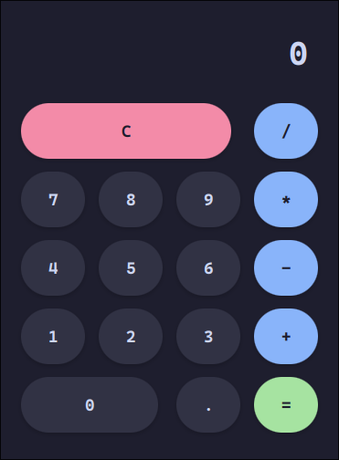

# 🧮 Incredible Calculator

A clean, robust, and modern Calculator application built with **JavaFX** and **Maven**. 
Designed with a strict separation of concerns (Service-Controller-View) and styled with the beautiful **Catppuccin Mocha** color palette.

## ✨ Features

* **Arithmetic Operations:** Addition, Subtraction, Multiplication, Division.
* **Robust Error Handling:** Safely handles division by zero and invalid inputs.
* **Modern UI:** Custom CSS styling based on the [Catppuccin Mocha](https://github.com/catppuccin/catppuccin) palette.
* **Responsive:** Styled with rounded buttons and hover effects for a premium feel.
* **Unit Tested:** Business logic is fully verified with **JUnit 5**.

## 🛠️ Tech Stack

* **Language:** Java 21 (OpenJDK)
* **Framework:** JavaFX 21
* **Build Tool:** Maven
* **Testing:** JUnit 5 (Jupiter)
* **Styling:** CSS3 (Catppuccin Theme)

## 🏗️ Architecture

This project follows a clean **MVC-like** architecture to ensure maintainability and testability:

* **`CalculatorService.java`**: Pure Java class containing the business logic. It is stateless and fully unit-tested without needing the GUI.
* **`CalculatorController.java`**: Handles the UI logic, manages state (`num1`, `operator`), and acts as a bridge between the View and the Service.
* **`calculator.fxml`**: The declarative UI structure.
* **`styles.css`**: The visual styling.

## 🚀 How to Run

### Option 1: Download the Jar
Go to the [Releases](../../releases) page and download the latest `.jar` file.

    java -jar Calculator-v1.0.0.jar

### Option 2: Build from Source
Prerequisites: Java 21+ and Maven.

1. Clone the repository
   
       git clone https://github.com/Kostaflo/CalculatorApp.git
       cd CalculatorApp

2. Build the Project
   
       mvn clean package

3. Run the App
   
       # Run via Maven
       mvn javafx:run
    
       # OR run the generated Fat Jar
       java -jar target/CalculatorApp-1.0.0-SNAPSHOT.jar

## 🧪 Running Tests

To verify the logic (Service layer), run the JUnit tests:

    mvn test

## 🎨 Theme

The UI uses the **Catppuccin Mocha** palette:
* **Background:** `#1e1e2e`
* **Buttons:** `#313244` (Surface0)
* **Operators:** `#89b4fa` (Blue)
* **Equals:** `#a6e3a1` (Green)
* **Clear:** `#f38ba8` (Red)

## 🤝 Contributing

Contributions are welcome! Please follow these steps:
1.  Fork the repository.
2.  Create a new branch (`git checkout -b feature/AmazingFeature`).
3.  Commit your changes (`git commit -m 'Add some AmazingFeature'`).
4.  Push to the branch (`git push origin feature/AmazingFeature`).
5.  Open a Pull Request.

## 📜 License

Distributed under the MIT License. See `LICENSE` for more information.
